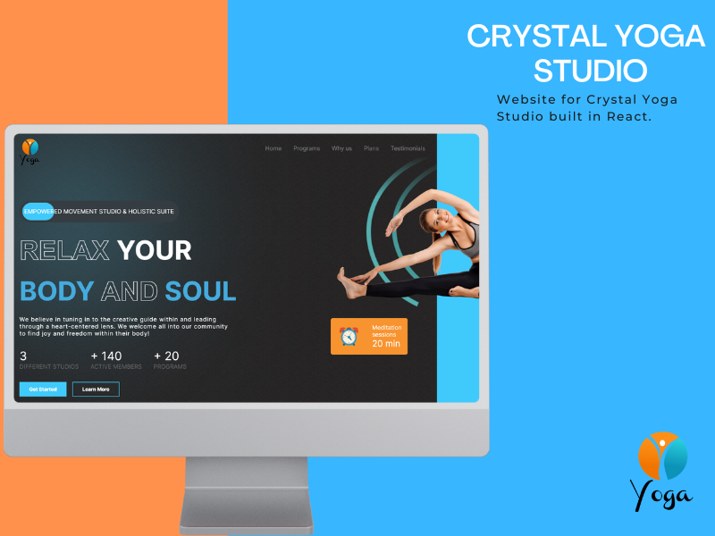

<a name="readme-top"></a>

<div align="center">

  <br/>

</div>


# 📗 Table of Contents

- [📗 Table of Contents](#table-of-contents)
  - [🛠 Built With ](#built-with)
    - [Key Features ](#key-features)
  - [🚀 Project Preview ](#preview)
  - [🚀 Live Demo ](#live-demo)
  - [💻 Getting Started ](#getting-started)
    - [Prerequisites](#prerequisites)
    - [Setup](#setup)
    - [Install](#install)
    - [Usage](#usage)
    - [Run tests](#run-tests)
    - [Deployment](#deployment)
  - [👥 Authors ](#authors)
  - [🔭 Future Features ](#future-features)
  - [🤝 Contributing ](#contributing)
  - [⭐️ Show your support ](#️show-your-support)
  - [🙏 Acknowledgments ](#acknowledgments)
  - [❓ FAQ ](#faq)
  - [📝 License ](#license)


# 📖 [Yoga_Studio_React] <a name="about-project"></a>

**Yoga_Studio_React** is a simple SPA React web application. Website for client Crystal Yoga Studio. This SPA is presentation of upcoming website for the client.

## 🛠 Built With <a name="built-with">
- React, JavaScript


### Key Features <a name="key-features"></a>

> Key features of the application are

- **Landing page**
- **Animations**

<p align="right">(<a href="#readme-top">back to top</a>)</p>


## 🚀 App Preview <a name="preview"></a>




<p align="right">(<a href="#readme-top">back to top</a>)</p>


## 🚀 Live Demo / Coming soon  <a name="live-demo"></a>

- [Live Demo]()

<p align="right">(<a href="#readme-top">back to top</a>)</p>


To get a local copy up and running, follow these steps.
### Prerequisites

In order to run this project you need:
`Git` and `Node.js` installed on your computer.

- For Windows users you can download Git from here: https://git-scm.com/download/win and Node.js from here: https://nodejs.org/en/download/
- For Mac users you can download Git from here: https://git-scm.com/download/mac and Node.js from here: https://nodejs.org/en/download/
- For Linux users you can download Git from here: https://git-scm.com/download/linux and Node.js from here: https://nodejs.org/en/download/


### Install

Install this project with:

```sh
  npm install # to install all the dependencies
```

### Usage

To run the project, execute the following command:

```sh
   npm start # for running the project in development mode
   npm run build # for building the project for production
```

Run tests
```sh
  npm test  # for running the tests
```

<p align="right">(<a href="#readme-top">back to top</a>)</p>


## 👥 Authors <a name="authors"></a>

👤 _Edi Sipka_

- GitHub: [@Edi-Sipka](https://github.com/edi-sipka)
- Twitter: [@sipka_edii](https://twitter.com/sipka_edii)
- LinkedIn: [Edi Sipka](https://www.linkedin.com/in/edi-%C5%A1ipka-5b681b202/)


👤 **Praises Tula**

[](https://github.com/PraisesPJMT/)
[](https://www.linkedin.com/in/praises-tula/)
[](https://twitter.com/PraisesPJMT/)

👤 **Nonhlanhla**

- GitHub: [@githubhandle](https://github.com/29td)
- LinkedIn: [LinkedIn](https://www.linkedin.com/in/nonhlanhla-mndebele-ab7448226/)


👤 **Youta Christabelle**

- GitHub: [Christabelle143](https://github.com/Christabelle143)
- Twitter: [@christabelleyo](https://twitter.com/christabelleyo)
- LinkedIn: [YoutaChristabelle](https://linkedin.com/in/YoutaChristabelle)

👤 **Okolike Assumpta**

- GitHub: [@githubhandle](https://github.com/summyalena)
- Twitter: [@twitterhandle](https://twitter.com/AOkolike)
- LinkedIn: [LinkedIn](https://www.linkedin.com/in/okolike-assumpta)

<p align="right">(<a href="#readme-top">back to top</a>)</p>


## 🔭 Future Features <a name="future-features"></a>

- Rotation of car models
- Improvements on UI design

<p align="right">(<a href="#readme-top">back to top</a>)</p>


## 🤝 Contributing <a name="contributing"></a>

Contributions, issues, and feature requests are welcome!

Feel free to check the [issues page](https://github.com/edi-sipka/Vip_Cars_Rails/issues).

<p align="right">(<a href="#readme-top">back to top</a>)</p>


## ⭐️ Show your support <a name="support"></a>

If you like this project buy the team a [drink](.../.../)

<p align="right">(<a href="#readme-top">back to top</a>)</p>


## 🙏 Acknowledgments <a name="acknowledgements"></a>

I would like to acknowledge:

- [Microverse](https://www.microverse.org/) for the opportunity to work on this project
- [The creative common](https://www.behance.net/gallery/19759151/Snapscan-iOs-design-and-branding?tracking_source=) for the design
- Design from [Murat Korkmaz on Behance](https://www.behance.net/gallery/26425031/Vespa-Responsive-Redesign)


<p align="right">(<a href="#readme-top">back to top</a>)</p>


## ❓ FAQ <a name="faq"></a>

- **How I can run this project?**

  - After cloning repository, run `npm install` to install all dependencies. Then run `npm start` to run the project.

- **How I can run tests?**

  - After cloning repository, run `npm install` to install all dependencies. Then run `npm test` to run the tests.

<p align="right">(<a href="#readme-top">back to top</a>)</p>

<!-- LICENSE -->

## 📝 License <a name="license"></a>

This project is [MIT](./LICENSE) licensed.


<p align="right">(<a href="#readme-top">back to top</a>)</p>